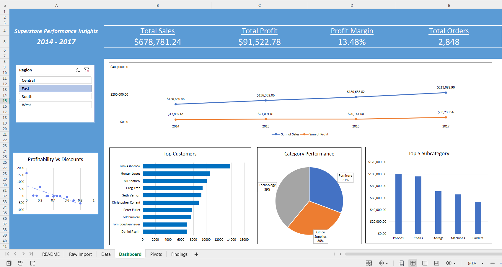

# 🛒 Superstore Sales Dashboard (Excel Project)

## 📌 Project Overview
This project analyzes sales, profit, and customer performance using the **Kaggle Superstore dataset**.    

---

## 🔧 Steps Taken
1. **Data Cleaning & Preparation**  
   - Removed duplicates, handled missing values  
   - Created calculated fields (Profit Margin %, Delivery Days)  

2. **Analysis & Transformation**  
   - Built Pivot Tables for Sales/Profit by Region, Category, and Customer Segment  
   - Trend analysis (sales & profit)  
   - Discount impact on profitability  

3. **Dashboard Design**  
   - KPI cards (Total Sales, Profit, Orders, Profit Margin)  
   - Interactive slicers (Region)
   - Line chart, bar chart and pie chart  

---

## 📊 Key Insights
- 📈 Sales are increasing year-over-year.  
- ⚠️ Discounts above 20% reduce profit margins significantly.  
- 🏆 Top 5% of customers contribute ~30% of total revenue.  

---

## 📷 Dashboard Preview
 

---

## 📁 Files
- `Superstore_Dashboard.xlsx` → Full interactive Excel file   

---

## 🚀 Skills Demonstrated
- Data Cleaning & Transformation  
- Pivot Tables & Charts  
- Slicers & Dashboard Interactivity  
- Business Insights & Storytelling  

---
